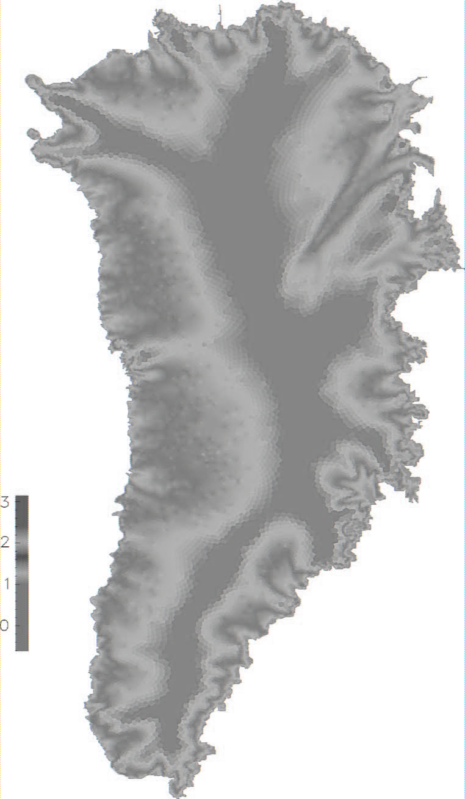

# Bitmap Editor

This simple bitmap editor is the product of my adventure of diving into the world of bitmap images, image processing and linear algebra.

---

### Bitmap Images:

The bitmap image file is a 2D raster graphic storing an image (digital) with varying options regarding the bitmap data and color channels.

The binary file of an bitmap image stores two kinds of headers, an optional color table for indexed bitmap data and the actual bitmap data representing the individual pixels of the image.

### Image processing

With the help of a kernel, also known as convolution matrix or mask, the original image data (pixels) will be convolved to accomplish a wide range of effects like the Gaussian blur, edge detection or sharpening.

### Linear Algebra

In order to draw geometric shapes into a bitmap image several topics of linear algebra were needed to for example correctly determine if a pixel lies within a triangle/square/circle shape.

Topics included: matrices and vectors, pythagorean theorem, scalar product (dot-product), barycentric weights 

---

## Editor Features

After compiling the project with gcc the bitmap-editor can be used over the command line. See below for the help page listing all available features with sample commands.

General info: most features work for 24bpp bitmap images only.

```console
lara@larapollehn:~/CodingProjects/bitmap-editor/cmake-build-debug$ ./lib help
usage: ./lib

The following are common commands:

get an overview of the bitmap infos (like headers)
   info          ./lib [info|-i] <src-file>
                 e.g.: './lib info lena.bmp'

make a copy of an bitmap image
   copy          ./lib [copy|-cp] <src-file> <dest-file>
                 e.g.: './lib copy lena.bmp lena_copy.bmp'

grayscale an image (naive (r+g+b)/3 )
   grayscale     ./lib [grayscale|-gs] <src-file> <dest-file>
                 e.g.: './lib grayscale lena.bmp lena_gray.bmp'

create 24bpp images and draw geometric shapes on them
   create        ./lib [create|-c] [width:|w:] int [height:/h:] int [color:/c:] int(r) int(g) int(b) <dest-file>
                 e.g.: './lib create w: 200 h: 200 c: 241 136 201 pink_panther.bmp'

   draw-circle   ./lib [draw|-d] [circle|-c] [radius:|r:] int [origin:/o:] int(x) int(y) [color:/c:] int(r) int(g) int(b) <dest-file>
                 e.g.: './lib draw circle r: 100 o: 50 75 c: 247 255 173 pink_panther.bmp'

   draw-rect     ./lib [draw|-d] [rectangle|-r] [pointE:/e:] int(x) int(y) [pointF:/f:] int(x) int(y) [pointG:/g:] int(x) int(y) [pointH:/h:] int(x) int(y) [color:/c:] int(r) int(g) int(b) <dest-file>
                 e.g.: './lib draw rectangle e: 50 50 f: 50 100 g: 100 100 h: 100 50 c: 71 167 255 pink_panther.bmp'

   draw-tri      ./lib [draw|-d] [triangle|-t] [pointE:/e:] int(x) int(y) [pointF:/f:] int(x) int(y) [pointG:/g:] int(x) int(y) [color:/c:] int(r) int(g) int(b) <dest-file>
                 e.g.: './lib draw triangle e: 50 150 f: 20 300 g: 300 300 c: 16 95 74 pink_panther.bmp'

simple image processing using image convolution and an 3x3 kernel
   convolution   ./lib [convolution|-cv] [kernel:|k:] int int int int int int int int int [divider:|d:] int <src-file> <dest-file>
                 e.g.: './lib convolution k: 1 0 -1 0 0 0 -1 0 1 d: 1 lena.bmp lena_edge_detect.bmp'

```

---

### Grayscale

A naive interpretation to grayscale an image with 3 color channels (red, green, blue). The gray shade is computed by adding the RGB color channel values and dividing the sum by three. Alpha Channels are not included.

<table  width="100%">
    <tr>
        <td>Before<br></td>
        <td>After</td>
    </tr>
    <tr> 
        <td></td>
        <td></td>
    </tr>
    <tr>
        <td></td>
        <td></td>
    </tr>
</table>

---

### Create and Draw

A completely new bitmap image can be created and as many (or none) triangles, rectangles and circles can be drawn onto it. The resulting image does not index the pixel colors, instead uses 3 Bytes (one for each of the three color channels) to store the colors directly in the image data (pixels).

<table width="100%">
    <tr>
        <td>Create</td>
        <td></td>
    </tr>
    <tr>
        <td>Draw Circle</td>
        <td></td>
    </tr>
    <tr>
        <td>Draw Rectangle</td>
        <td></td>
    </tr>
    <tr>
        <td>Draw Triangle</td>
        <td></td>
    </tr>
</table>

---

### Convolution

With the use of a 3x3 kernel and the belonging divider the original bitmap image is convolved. 
Edge Handling: Crop (all the edge pixels are untouched)

##### 1. Edge Detection (different kernels)
<table width="100%">
    <tr>
        <td>Before<br></td>
        <td>After</td>
    </tr>
    <tr>
        <td></td>
        <td></td>
    </tr>
    <tr>
        <td></td>
        <td></td>
    </tr>
</table>

##### 2. Blur (Box Blur & Gaussian Blur)
<table width="100%">
    <tr>
        <td>Before<br></td>
        <td>After</td>
    </tr>
    <tr>
        <td></td>
        <td></td>
    </tr>
    <tr>
        <td></td>
        <td></td>
    </tr>
</table>

##### 3. Sharpen
<table width="100%">
    <tr>
        <td>Before<br></td>
        <td>After</td>
    </tr>
    <tr>
        <td></td>
        <td></td>
    </tr>
    <tr>
        <td></td>
        <td></td>
    </tr>
</table>

### References
- [BMP Files](https://people.math.sc.edu/Burkardt/data/bmp/bmp.html)
- [Image Processing](https://de.wikipedia.org/wiki/Windows_Bitmap)
